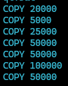

# AirlineSchedulingSystem_DatabaseProject
## Work By: Avraham Meyers and Eli Isaacs

As part of the class project of an airline management system, we are tasked with the scheduling system. This involves the following entities:

- Flight
- Aircraft
- Crew
- Gate
- Airport
- Weather

Our system for scheduling is modeled around the **Flight** entity, as we account for all flight information to assign flights the proper aircraft, crew members, and the gates and airports for departure and arrival. Additionally, we account for the weather conditions at the respective airports.

### Entity Relationships

- **Flight**:
  - Many-to-One relationship with **Aircraft**: Each flight uses a single aircraft, while an aircraft can be used for multiple flights at different times.
  - Many-to-One relationship with both **Departure Gate** and **Arrival Gate**: Multiple different flights could leave and arrive at the same gate, just not at the same time.
  - Many-to-One relationship with both **Departure Airport** and **Arrival Airport**: Multiple flights could come from the same departure airport and multiple flights could arrive at an arrival airport.
  - One-to-Many (optional) relationship with **Crew**: A flight can have multiple crew members assigned (pilots, first officer, steward). Some crew members might not necessarily be assigned to a flight, therefore the **Crew** table's foreign key to **Flight** is nullable.

- **Gate**:
  - Many-to-One relationship with **Airport**: There are multiple gates that belong to a specific airport. Each gate is used by specific flights for departure and arrival as well as at the airports.

- **Airport**:
  - Has flights departing and arriving at specific airports. An airport can have multiple departing and arriving flights.

- **Weather**:
  - Many-to-One relationship with **Airport**: Weather data is recorded for a specific airport at a specific time. An airport can have multiple weather entries over time.

ERD:

DSD:

Output from copy data file:

